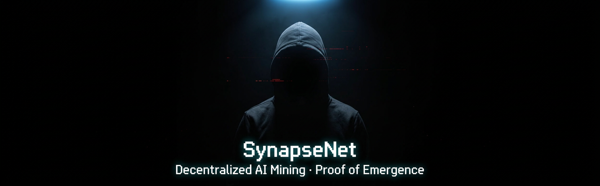

  

<h1 align="center">Kepler</h1>

  Cryptography · Low-Level Engineering · Systems Programming 
  Building tools that run close to the metal — scripts, protocols, and projects from scratch.

---

<h3 align="center">Languages</h3>

  
  
  
  
  

---

  

<h3 align="center">Navigation</h3>

  
  
  
  
  
  

  
  
  
  
  
  
  

  
  
  
  

  If you find this project worth watching — even if you can't contribute code — you can help keep it going. 
  Donations go directly toward VPS hosting for seed nodes, build infrastructure, and development time.

  

  <strong>Status Update</strong> 
  The website and VPS infrastructure are currently in development. Once the alpha release is finished, the public rollout will follow soon. Until then, I am continuing to stabilize the alpha, fix bugs, ship hardening updates, and add new improvements.

---

<h3 align="center">Projects</h3>

<table align="center">
  <tr>
    <td align="center" width="500">
      <h4>Synapsenetai</h4>
      
Full source code — the C++ node daemon, Go terminal IDE, VS Code extension, CI pipelines, tests, and all architecture documents. This is where the actual project lives.

      

        
        
        
        
        
        
        
        
        
        
      

    </td>
  </tr>
  <tr>
    <td align="center" width="500">
      <h4>SynapseNet</h4>
      
Documentation, whitepaper, and design specs. Architecture overview, Proof of Emergence formal supplement, implementation status, and the organized documentation index.

      

        
        
      

    </td>
  </tr>
</table>

---

<h3 align="center">Latest Changes</h3>

<table align="center">
  <tr>
    <td align="center" width="500">
      <strong>0.1.0-alphaV4 (In Development)</strong>
      <ul style="display: inline-block; text-align: left;">
        <li>Major migration branch replacing the legacy Go terminal client with a C++ and desktop-app workflow</li>
        <li>Planned direction: Tauri desktop app with Svelte frontend, Rust shell, and direct C++ integration</li>
        <li>Target UX includes Monaco-based editing, AI chat, patch mode, and guided setup flows</li>
        <li>Release status: active development, not finalized yet</li>
      </ul>
      

        
      

    </td>
  </tr>
  <tr>
    <td align="center" width="500">
      <strong>0.1.0-alphaV3.7</strong> — March 27, 2026
      <ul style="display: inline-block; text-align: left;">
        <li>Security hardening release covering 18 audited fixes across cryptography, consensus, RPC, networking, sandboxing, updates, and model download paths</li>
        <li>Replaced custom XOR-based session crypto with AES-256-GCM and removed the legacy XOR wallet loading path</li>
        <li>Enforced signed consensus votes, hardened RPC handling, added replay protection, SOCKS5 auth support, DNS timeout handling, and PBKDF2 increase to 100,000 iterations</li>
        <li>Added sandbox verification reports for the release notes</li>
      </ul>
      

        
      

    </td>
  </tr>
  <tr>
    <td align="center" width="500">
      <strong>0.1.0-alphaV3.6</strong> — March 26, 2026
      <ul style="display: inline-block; text-align: left;">
        <li>Modularized main.cpp — from 4,809 lines to 117 (separation of concerns)</li>
        <li>New synapse_net.h opaque interface with factory functions</li>
        <li>SynapseNet class moved to dedicated translation unit (synapse_net.cpp)</li>
        <li>Zero behavior change — 267/267 tests passing</li>
      </ul>
      

        
      

    </td>
  </tr>
  <tr>
    <td align="center" width="500">
      <strong>0.1.0-alphaV3.5</strong> — March 26, 2026
      <ul style="display: inline-block; text-align: left;">
        <li>Real Ed25519 signatures via libsodium (was SHA-256 simulation)</li>
        <li>Real X25519 key exchange via libsodium (was fake DH)</li>
        <li>CSPRNG via libsodium randombytes_buf (was Mersenne Twister)</li>
        <li>Wallet encryption routed by SecurityLevel (STANDARD/HIGH/QUANTUM_READY)</li>
      </ul>
      

        
      

    </td>
  </tr>
  <tr>
    <td align="center" width="500">
      <strong>0.1.0-alphaV3</strong> — March 25, 2026
      <ul style="display: inline-block; text-align: left;">
        <li>Hybrid mesh — Tor nodes and clearnet nodes in the same network</li>
        <li>Clearnet nodes connect to .onion via SOCKS5</li>
        <li>Tor nodes accept direct inbound from clearnet</li>
        <li>One unified mesh replacing separate networks</li>
      </ul>
      

        
      

    </td>
  </tr>
  <tr>
    <td align="center" width="500">
      <strong>0.1.0-alphaV2</strong> — March 25, 2026
      <ul style="display: inline-block; text-align: left;">
        <li>3-node devnet running over Tor hidden services</li>
        <li>All P2P routed through Tor SOCKS5 — zero clearnet traffic</li>
        <li>Nodes reachable only via .onion addresses</li>
        <li>Automated launch script for Tor devnet</li>
      </ul>
      

        
      

    </td>
  </tr>
  <tr>
    <td align="center" width="500">
      <strong>0.1.0-alpha</strong> — March 25, 2026
      <ul style="display: inline-block; text-align: left;">
        <li>Fixed post-quantum signature verification (Dilithium + SPHINCS+)</li>
        <li>Fixed inbound peer address resolution for dual-stack sockets</li>
        <li>3-node local devnet fully operational — peers connect and sync</li>
        <li>267/267 tests passing, 610/610 build targets</li>
      </ul>
      

        
      

    </td>
  </tr>
</table>

---

<h3 align="center">Operating Systems</h3>

  
  
  

  I use my phone running Ubuntu on Android to write code on the go — stays connected to the project 24/7, online and locally.

---

<h3 align="center">Inspired By</h3>

  
  
  
  

---

<h3 align="center">Story</h3>

  

---

<h3 align="center">Hire Me</h3>

  Open for contract work — scripts, standalone projects, code repair, architecture consulting, full websites, and Web3 builds. 
  Fair rates. Payment accepted in any convenient crypto.

  

  
  
  
  
  

