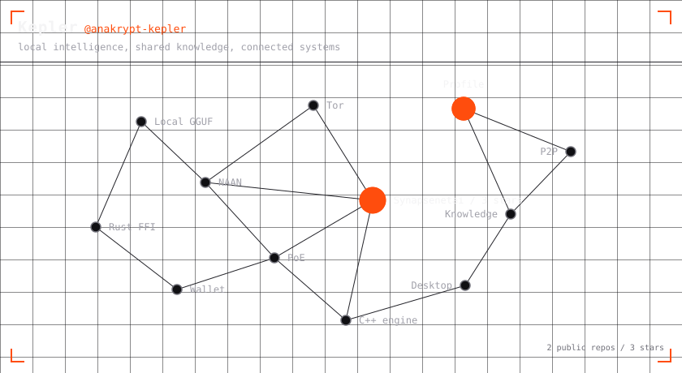
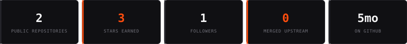
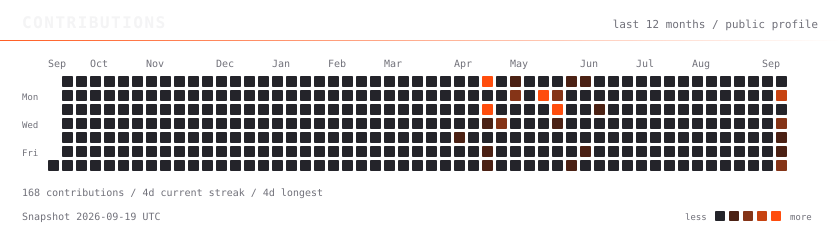
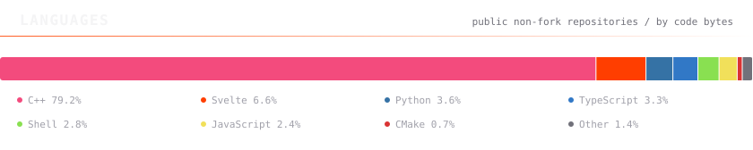
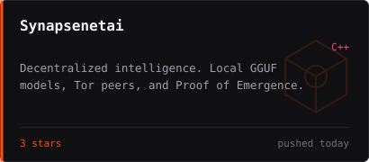
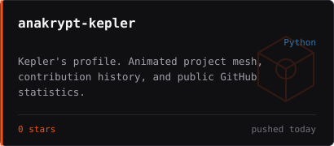
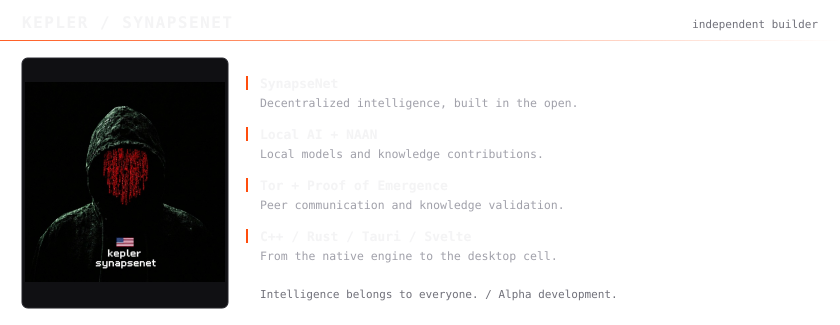
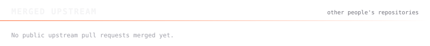
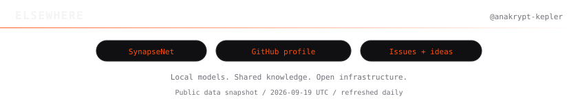

  <picture><source media="(prefers-color-scheme: light)" srcset="assets/net-light.svg" /></picture>
  <picture><source media="(prefers-color-scheme: light)" srcset="assets/tiles-light.svg" /></picture>
  <picture><source media="(prefers-color-scheme: light)" srcset="assets/heat-light.svg" /></picture>
  <picture><source media="(prefers-color-scheme: light)" srcset="assets/langs-light.svg" /></picture>

  <picture><source media="(prefers-color-scheme: light)" srcset="assets/selected-light.svg" /></picture>
  <a href="https://github.com/anakrypt-kepler/Synapsenetai"><picture><source media="(prefers-color-scheme: light)" srcset="assets/card-synapsenetai-light.svg" /></picture></a>
  <a href="https://github.com/anakrypt-kepler/anakrypt-kepler"><picture><source media="(prefers-color-scheme: light)" srcset="assets/card-anakrypt-kepler-light.svg" /></picture></a>

  <a href="https://github.com/anakrypt-kepler/Synapsenetai"><picture><source media="(prefers-color-scheme: light)" srcset="assets/portrait-light.svg" /></picture></a>
  <picture><source media="(prefers-color-scheme: light)" srcset="assets/upstream-light.svg" /></picture>
  <picture><source media="(prefers-color-scheme: light)" srcset="assets/footer-light.svg" /></picture>
  <a href="https://github.com/anakrypt-kepler/Synapsenetai">SynapseNet</a> · <a href="https://github.com/anakrypt-kepler?tab=repositories">All repositories</a> · <a href="https://github.com/anakrypt-kepler/Synapsenetai/issues">Issues &amp; ideas</a>

